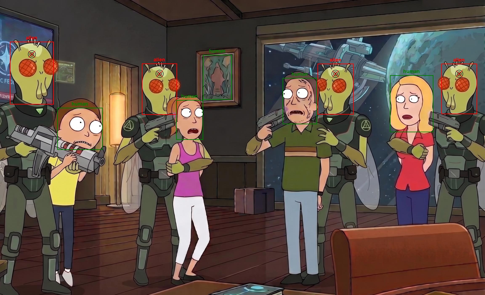
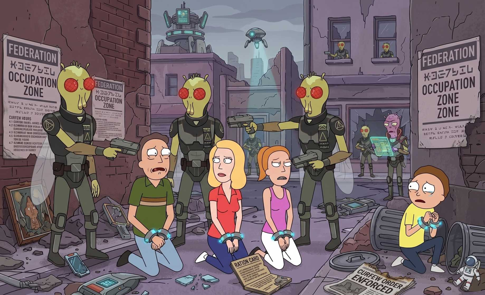
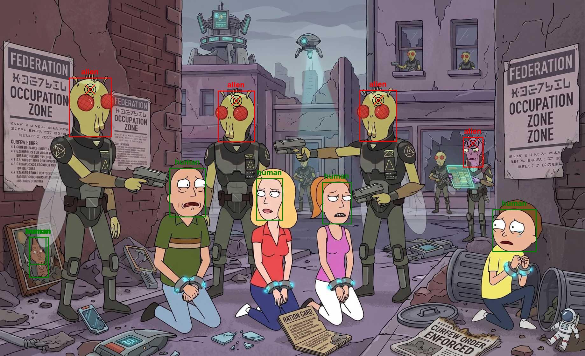
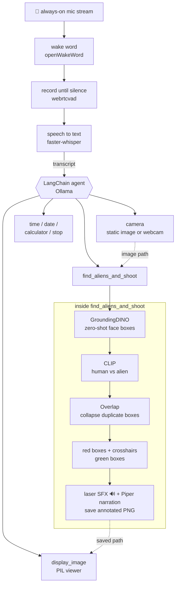
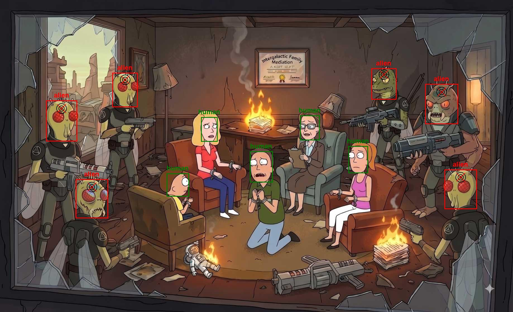
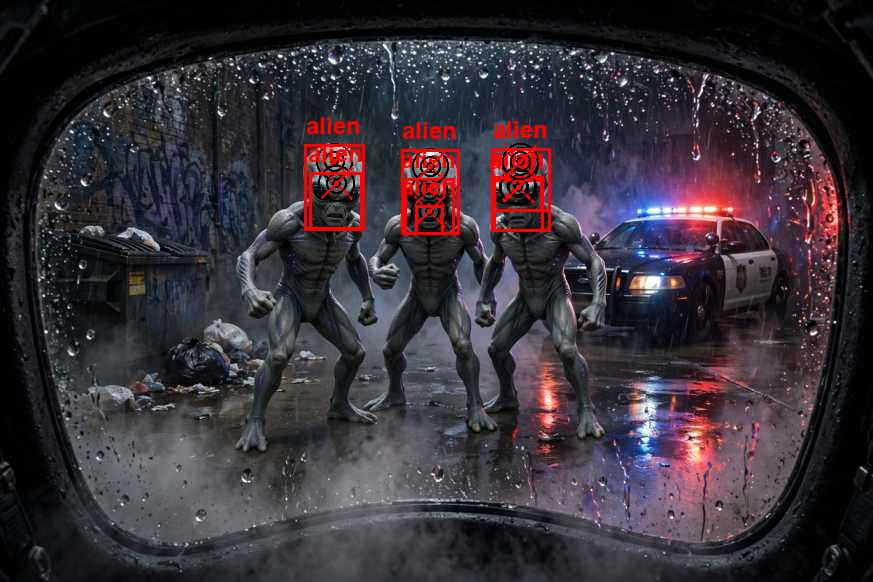
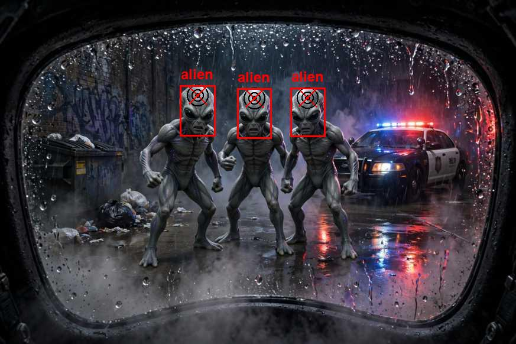

# AI Gun: Rick and Morty Edition

Rick's AI gun (S04E10-7:59) that automatically finds and shoots aliens *(gun **NOT** included)*.

Say the wake word and tell it what to do, and a local LLM decides which tools to run. It grabs a frame from the camera, finds every face in it, decides whether each face is human or alien, paints crosshairs on the aliens, fires the laser (sound only, we promise), and shows you the proof.

Everything runs on your own machine, including the wake word, the speech recognition, the speech synthesis, the vision models and the LLM itself (can't find Anthropic or OpenAI APIs in space). The LLM best suited for this use case I dound was `granite4.1:3b` and `qwen3.5:4b`. Other models can do the job but these were the ***smallest ones*** that could do ***tool calling***, ***instruction following*** and ***agentic Reasoning*** perfectly (Would'nt want a slow or malfuctioning Gun while fighting aliens). There is no cloud inference anywhere in the pipeline and you do not need any API keys.


## Results

Aliens get a red box and a crosshair on the forehead, humans get a green box, and the laser fires once for every alien found. Nothing is hard-coded to a particular image, because detection is zero-shot, which means it works just as well on cartoon frames as it does on photoreal renders.

| Input | After the gun |
| --- | --- |
|  |  |
|  |  |


## How it works



1. **`inputLoop`** in `tools/audio_io.py` holds an always-on microphone stream, and openWakeWord scans a rolling window till it finds the "wake up word". A short pre-roll buffer is kept at all times so that the first syllable spoken after the wake word is never clipped off the front of the recording.
2. Once the gun is awake, webrtcvad decides frame by frame whether you are still talking. Recording stops after a brief run of silence, or when the utterance hits its hard length cap, or when nothing is said at all and the wake turns out to have been a false positive.
3. The recorded utterance goes to `faster-whisper`, and the resulting transcript is handed straight to the callback, which is  `langGraph` llm agent in `main.py`.
4. It uses local Ollama model and invokes it with the words that the user spoke.
5. The agent then picks the tools it needs, and `find_aliens_and_shoot` is the interesting one
   - `GroundingDINO-tiny` performs zero-shot detection of `face`E
   - Every resulting crop is run through `openAI CLIP model` against the prompt list in `CLASSIFICATION_LABELS`, which holds several human phrasings, several alien phrasings, and a "not a face" escape hatch for bad crops.
   - Detections are sorted into alien, human and other buckets, and each bucket is then de-duplicated as described in [Merging overlapping boxes](#merging-overlapping-boxes).
   - The resulting classifications and displayed ontop of the input image - red for *alien* and green for ***human***, everything else is ignored.
   - ***aliens*** also get shot, we determine an appropriate head shot loaction, mark it on the image (**and shoot**). The model the shows the oof and summarizes what it did.
6. The agent is instructed to always call `display_image` once it is done, so the finished image pops open on its own.

If the audio queue ever backs up past its limit, which usually means the models are hogging the CPU, the loop drains the backlog and resets the wake model rather than drifting further and further behind the microphone.

The display pipeline can sometimes go OOM because of the models and image processing. But the `langGraph` logic and error handling in the tools are stong enough to keep trying.

### Merging overlapping boxes

GroundingDINO will happily return several boxes for a single face based on its thresholds, typically one tight crop, one looser crop, and sometimes a sliver that only half covers it. If those are left alone, one alien ends up wearing three crosshairs and taking three laser shots, so the `Overlap` class in `tools/boundingBox.py` collapses them back down into one detection each.

| Without Overlap removal | Overlap removed |
| --- | --- |
|  |  |
|  |  |

Merging runs separately on each category, which guarantees that an alien box can never absorb a neighbouring human one. Two boxes are treated as the same detection when the fraction below reaches `MERGE_THRESHOLD`, at which point they are replaced by the smallest box that contains both of them:

```
        intersection area
ratio = ─────────────────
        min(areaA, areaB)
```

The merge repeats until a full pass over the list finds nothing left to combine, so overlaps are followed transitively. If A merges with B and the box that results from it then overlaps C, all three of them collapse into a single box.

The denominator is deliberately the smaller of the two areas rather than their union, which is what an IoU would use. Dividing by the smaller area asks how much of the smaller box has been swallowed by the larger one, so a tight crop sitting entirely inside a looser crop scores a perfect 1.0 and always merges no matter how different the two sizes are, and that is exactly the duplicate detection case this is meant to catch. The trade-off is that a single large spurious box spanning several distinct faces will absorb all of them into one detection, and the IoU variant is left commented out inside `intersection()` if you would rather have that case survive instead.


## Requirements

- **Python 3.13+**, pinned via `.python-version`
- **[uv](https://docs.astral.sh/uv/)** for dependency management
- **[Ollama](https://ollama.com/)** running locally, with the model you intend to use already pulled
- A microphone, plus speakers if you want to hear the narration and the laser
- A webcam, but only if you intend to pass `--use_real_camera`
- Windows is the pinned platform through `tool.uv.environments`, and the torch index is pinned to CUDA wheels. CUDA itself remains optional, because the vision models fall back to the CPU whenever `torch.cuda.is_available()` returns false.

## Setup

```bash
uv sync                      # install everything, including dev tools
ollama pull granite4.1:3b    # or whichever model you plan to use
```

The first run downloads several things automatically into `.tmp/` and into the HuggingFace cache, namely the Piper voice, the Whisper weights, GroundingDINO-tiny and CLIP. The openWakeWord models sometimes need a one-time fetch of their own:

```bash
uv run python -c "import openwakeword.utils as u; u.download_models()"
```

## Usage

```bash
uv run main
```

Say **"hey jarvis"**, wait for the `[wake]` line to appear, and then give it a command such as *"take a picture using the camera, find the alien faces, and shoot them."* To shut everything down, say "stop", "quit" or "exit", or press `ctrl+c`.

> I am still loking into training own wake up word `"hey gun"` model. Just the way it should be like in Rick and Morty.

You can also run the detector directly against the bundled test images, with no voice and no LLM involved at all:

```bash
uv run check
```

### CLI flags

| Flag | Effect |
| --- | --- |
| `image_path` (positional, optional) | Use this image as the static camera feed instead of the configured default. |
| `--use_real_camera` | Use OpenCV device 0 instead of the static image. |
| `--model MODEL` | Ollama model tag for the agent. |
| `--disable_audio_output` | Silence Piper TTS and the laser SFX. |
| `--dummy_run` | Run one hard-coded prompt through the agent and exit, with no mic and no wake word. |
| `-d`, `--debug` | Enable LangChain agent debug logging. |

---

## Configuration

Runtime configuration lives in `src/rnm/config.py` as module-level constants, which every module imports as `CONFIG`, and the CLI flags mutate those constants inside `process_args()` before anything else starts up.

| Name | Meaning |
| --- | --- |
| `STATIC_IMAGE_PATH` | The image used as a fake camera feed. It has to exist, otherwise the import fails. |
| `DYNAMIC_IMAGE_PATH` | Where captures from the real webcam are written. |
| `OUTPUT_IMAGE_DIR` | Where annotated results are saved, one UUID-named PNG per shot. |
| `TTS_MODEL_DIR` | Where the downloaded Piper voice is kept. |
| `THINKING_WORDS` | The file holding the comma-separated loader words. |
| `LASER_PATH` | The laser sound effect, stored as raw mono int16. |
| `CLASSIFICATION_LABELS` | The CLIP prompt list. Add a label here to widen what counts as human or as alien. |
| `MERGE_THRESHOLD` | The overlap fraction above which two boxes are treated as one detection. Raise it when distinct faces are being fused together, and lower it when you keep getting duplicate crosshairs on one face. |
| `model` | The default Ollama model. A lot of models can work, but I tried *a lot* of models with search crinteria: smallest possible model for fast+local usage AND good tool calling+instruction following |
| `DEBUG`, `USE_REAL_CAMERA`, `AUDIO_OUTPUT` | Flags that get set from the CLI. |

The audio tuning constants, covering the wake word, its thresholds, the silence window and the VAD aggressiveness, all sit together at the top of `src/rnm/tools/audio_io.py`. The two GroundingDINO detection thresholds are inline in `src/rnm/tools/boundingBox.py`.

`.env` is loaded through `python-dotenv` at startup and exists only for optional [LangSmith](https://smith.langchain.com/) tracing, through `LANGSMITH_TRACING`, `LANGSMITH_ENDPOINT`, `LANGSMITH_API_KEY` and `LANGSMITH_PROJECT`. You can create those if you want to do some debugging but otherwise no keys or APIs needed. It all runs locally.


## Project layout

```
src/
  rnm/
    main.py              CLI parsing, agent construction + system prompt, Loader, entrypoint
    config.py            paths, directory creation, runtime flags, model choice, CLIP labels
    tools/
      audio_io.py        wake word + VAD + Whisper input loop, PiperTTS, laser SFX
      visual_io.py       camera (static/webcam) and display_image tools
      boundingBox.py     GroundingDINO + CLIP detection, box merging, crosshairs, find_aliens_and_shoot
      misc_tools.py      time, date, calculator, stop
  thinking.txt           loader vocabulary
  laser.raw              laser sound effect (raw PCM)
assets/                  README example images
tests/                   pytest suite
.tmp/                    models, sample images, generated output (mostly gitignored)
```

### Models

| Role | Model |
| --- | --- |
| Wake word | openWakeWord `hey_jarvis` (ONNX) |
| Voice activity | webrtcvad |
| Speech to text | faster-whisper `small.en`, CPU / int8 |
| Text to speech | Piper `en_US-hfc_female-medium` |
| Object detection | `IDEA-Research/grounding-dino-tiny` |
| Classification | `openai/clip-vit-base-patch32` |
| Agent | Ollama, default `granite4.1:3b` |

## License

MIT, see [LICENSE](LICENSE). © 2026 Deekshant Wadhwa
