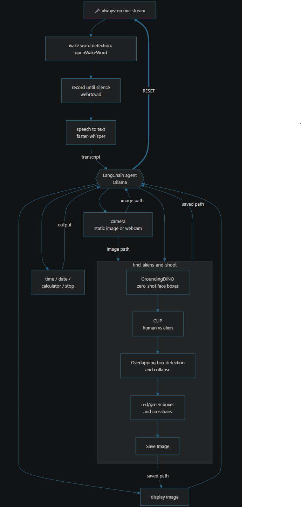
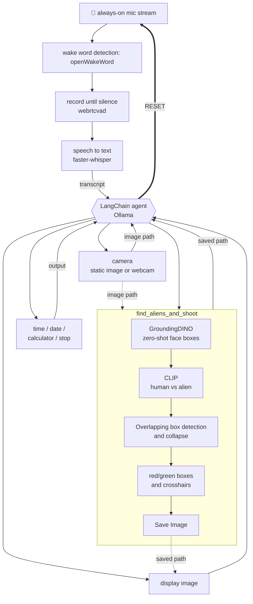

# Actual Workflow

This chart is not rendering properly so the shown on the homepage is a minified version and this one is the detailed version that can be rendered inside a 3rd Party rendering tool. The one used to generate it is [Markdown All in One](https://marketplace.visualstudio.com/items?itemName=yzhang.markdown-all-in-one) in VS Code.

### Image Version

### Interactive

